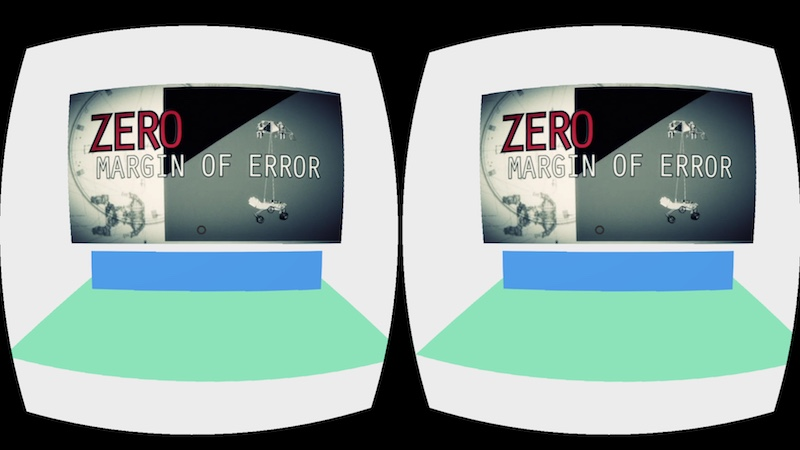

# ohgeevee

Just a for fun project, testing integration of [ogv.js](https://github.com/brion/ogv.js) JS video playback into [A-frame](https://aframe.io/) WebGL/WebVR VR framework.

# Demo

The demo loads some very simple geometry: a floor, a flat control bar, and a plane for projecting a video.

Gaze at the video plane or the control bar and tap/click to start/stop the video. (In some desktop browsers the video may autoplay, but in mobile browsers you'll need to tap or click first.)

If the browser supports WebM VP8+Vorbis playback natively (Firefox, Chrome) it will use native decoding, otherwise (Safari, Edge) it will use the ogv.js decoder automatically. This uses more CPU, but on a background thread so "in theory" should not slow down main-thread rendering too much. Edge seems to have some problems and the video texture flickers a lot, but Safari works nicely.

[See current live demo](https://brionv.com/misc/ohgeevee/).

# Is this useful?

Maybe not! But it's pretty cool.

And it confirms that you can use a dynamically-updated `<canvas>`, even a WebGL-backed one, as a texture source in your scene fairly easily. That could be used to, for instance, draw graphics for an in-game simulated terminal or other computery thing.

# Using ogv.js in A-Frame

The A-frame `<a-video>` element is used, with reference to a backing `<video>` element in the document.

At load time, we check the video's `canPlayType()` method to see if the WebM should be supported, and if not the `<video>` is replaced with an `<ogvjs>` created via `new OGVPlayer()`.

However, A-Frame's backing three.js library doesn't know how ogv.js works, and would pass the `<ogvjs>` element directly into the texture, which WebGL won't understand how to upload from.

So, we switch the `id` attribute over from the `<ogvjs>` to its contained `<canvas>`, which WebGL *can* use as a texture upload source.

# Playback and audio issues

Mobile browser limitations on audio autoplay mean you need to get the user to tap on something first to set up the audio. Kind of a pain but doable.

# Making it more convenient

This logic could be encapsulated into a component; might do so for fun.

# Making it more efficient

The video texture component in three.js which backs `<a-video>` appears to re-upload the texture on every VR output frame, as it has no way of knowing the frame rate of the source video.

If you're using a source video (or custom canvas) with a lower frame rate, it might be better to rate-limit that?

# Making it more awesome

Todo:
* add some lighting/texture
* more controls than start/stop
* select more videos
* don't autoplay on desktop!
* fix the interaction between click-to-drag and click-to-play/pause on desktop
* actually try it out on real VR headset!
* support controllers other than raw look-at-it-and-tap-something
